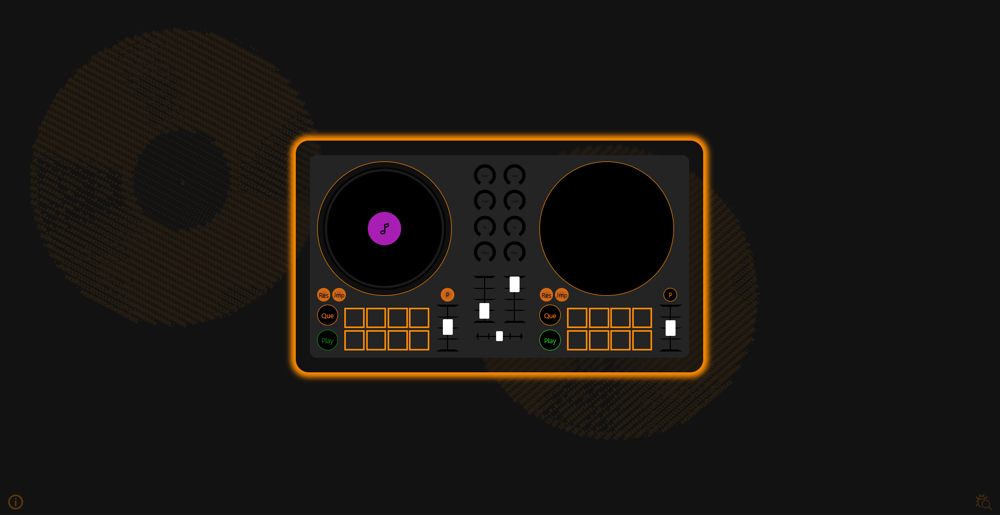

# DJ Controller

A web-based DJ controller with basic functionality, built with React and Vite.

## Usage

Visit: [DJ Controller on Vercel](https://djcontroller.vercel.app)

### How to Use

1. Click on a jog wheel
2. Press the play button
3. Mix up your songs

Take a look at the [samples songs](./samples) if you need some music

### Controls

| Button                                          | Description                                                                   |
|-------------------------------------------------|-------------------------------------------------------------------------------|
|  | Use the preserve pitch button to preserve the pitch when speeding up the song |
|  | Use it to reset the que point                                                 |
|    | Jump to the que point                                                         |

| Key     | Description                        |
|---------|------------------------------------|
| `Space` | Start/Stop the song                |
| `Q`     | Que button                         |
| `J`     | Jump to que point                  |
| `R`     | Reset que point                    |
| `P`     | Toggle preserve pitch              |
| `C`     | Select new Songs                   |
| `1 - 8` | Play performance pad sound effects |


---
## Run locally

### Requirements

- Git
- Node.js
- npm

### Instructions

First, clone the repository:
```bash
git clone https://github.com/Suchti18/dj_controller.git
```

Change your working directory to the repository:
```bash
cd dj_controller
```

Install dependencies:
```bash
npm install
```

Start the development server:
```bash
npm run dev
```

## Example


---

## 🤖 AI Disclaimer

AI helped in following areas:
* Debugging

---

## 📜 License

[Unlicense](https://unlicense.org)
